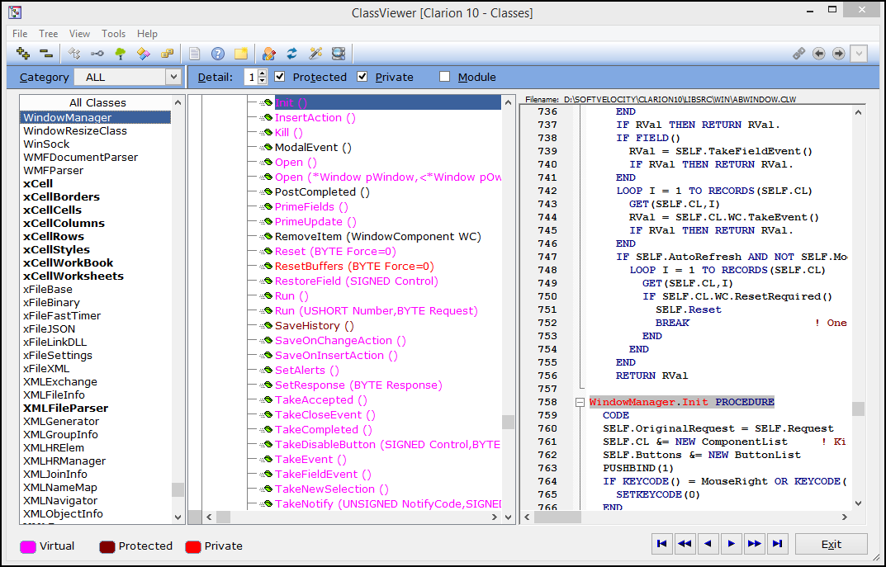

# About ClassViewer #

----------

**ClassViewer** is a utility program that combines the features of the Clarion Application Builder Class Viewer and the CallTree utility. With this program you can analyze all classes (not just ABC), make annotations, view the class source and help files.

We develop a lot of classes here at Devuna. It is not possible to use Clarion's Application Builder Class Viewer while actually working in the Clarion editor. I found it very time consuming to exit my editing, go to the globals tab, scroll the tabs and access the Application Builder Class Viewer. Not only that, I often forgot the details by the time I returned to my editing.

Another shortcoming of the Application Builder Class Viewer is that it only works with Clarion's ABC classes or classes developed by others that contain the '!ABCIncludeFile' comment in the include (.INC) file. Developers often add this comment just so their classes can be viewed with the Application Builder Class Viewer. The down side of creating a class with the !ABCIncludeFile comment is that the application generator creates an instance of the object in your global DLL or executable, even if you don't want it. Also, some user developed classes require supporting libraries to be linked in for the classes to compile properly and the default generator behaviour can cause compile errors.

I was constantly writing notes to keep track of what various class methods did and how they behaved and interacted. The documentation and help files really could use an annotation mechanism.

There is also a Clarion utility named calltree.exe that lets you view the class method calling hierarchy. I used it a few times but discovered that it wasn't always accurate.

Clearly, a utility program that let me **view any class**, it's **methods** and **interfaces**, it's **call tree**, **structures**, **equate values**, and **source code** was something that I could use. 

**ClassViewer** does all this and more. It works with classes from all Clarion Versions, understand the new Clarion INTERFACE mechanism and allows the user to keep notes about the methods. It gives you the ability to view all classes or just the ABC classes and access the help file. The user can also specify other files to include in the scan process as well as set color and tooltip preferences.

# Overview #

The **setup** folder contains the ***ClassViewerSetup.exe*** program for installing ClassViewer for Clarion Version 10.  The **SetupBuilder** subfolder contains the [**SetupBuilder®**](http://www.lindersoft.com/products_setupbuilder_dev.htm) install project used to create ***ClassVIewerSetup.exe*** 

# Getting Started #

----------

The DEVUNA repositories contain source code written in and for [Clarion for Windows®](http://www.SoftVelocity.com)

Our repositories utilize the same folder structure as Clarion for Windows®.  Here is a list or the repository folders and their typical location in Clarion for Windows® version 10:

documents - CSIDL\_COMMON_DOCUMENTS/Softvelocity/Clarion10/Accessory/Devuna/documents/[project name] (e.g. CoolTips)

examples - CSIDL\_COMMON_DOCUMENTS/SoftVelocity/Clarion10/Accessory/Devuna/examples/[project name]

images - SoftVelocity/Clarion10/Accessory/images

libsrc/win - SoftVelocity/Clarion10/Accessory/libsrc/win

template/win - SoftVelocity/Clarion10/Accessory/template/win

# Requirements #

----------

The source code in this repository requires some templates and classes that are found in other repositories.  The following Devuna repositories contain templates and classes used by the this application:

1. [**Devuna-Common**](https://github.com/Devuna/Devuna-Common) - #EXTENSION and #CONTROL templates.
2. [**Devuna-Scintilla**](https://github.com/Devuna/Devuna-Scintilla) - Scintilla class and templates.
3. [**Devuna-IQXML**](https://github.com/Devuna/Devuna-IQXML) - IQXML library and templates. ***Note: this repository has an IQXML folder that contains the Clarion 10 IQXML setup program.***

# Documentation #

----------

Documentation for using **ClassViewer** can be found in the Help folder of the repository.  The Help folder contains everything needed to build an HTML_Help file for the **ClassViewer** application.
